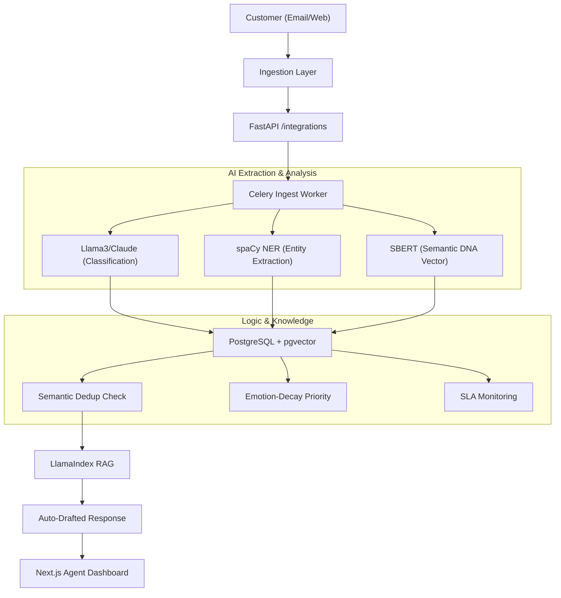

# CREST — Complaint Resolution & Escalation Smart Technology
### **Union Bank of India · iDEA 2.0 Hackathon · Phase 2 (POC Stage)**
**India's first RBI-aligned, Gen-AI powered grievance intelligence platform.**

---

## 📂 (A) Problem being Solved
Union Bank of India serves millions of customers across diverse regions. Current grievance systems face three critical bottlenecks:
1. **The "Duplicate" Storm**: Redundant tickets across Email/Twitter/App waste 30% of agent time.
2. **Static Prioritization**: FIFO queues ignore high-emotion P0 cases and decaying SLAs.
3. **Response Inconsistency**: Manual drafting leads to compliance and quality risks.

### **The Three Core Innovations**
- **Complaint DNA Fingerprinting**: converted into 768-dim vectors. Cosine similarity > 0.92 flags duplicates instantly via **pgvector**.
- **Emotion-Decay Priority Queue**:
  `priority_score = severity_weight × anger_score × MIN(3.0, 1 + LN(1 + hours_waiting / 8))`
- **Grounded RAG Engine**: Auto-drafts responses strictly using the Union Bank Service Manual.

### **Technical Workflow**


---

## 💻 (B) How to Run Locally

### **Project Structure**
```
crest/
├── backend/            # FastAPI + SQLAlchemy
├── ai/                 # RAG, NER, & Embeddings
├── integrations/       # Email & Channel Listeners
├── frontend/           # Next.js 14 Dashboard
└── scripts/            # Demo seeding & tools
```

### **Quick Start**
1. **Env**: `cp .env.example .env` and add your `GROQ_API_KEY`.
2. **API**: `uvicorn backend.main:socket_app --port 8000 --reload`
3. **Worker**: `celery -A backend.workers.celery_app worker --loglevel=info -P solo`
4. **UI**: `cd frontend/nextjs-app && npm run dev`

---

## 🛠️ (C) Libraries & Dependencies
- **AI**: `llama-index`, `sentence-transformers`, `spacy`, `groq`.
- **Backend**: `fastapi`, `sqlalchemy`, `pgvector`, `celery`, `redis-py`.
- **Frontend**: `next`, `tailwind-css`, `socket.io-client`, `lucide-react`.

---

## 📊 (D) Sample Dataset & Simulation
Evaluators can populate the system with 50+ realistic grievances using:
```bash
python -m backend.utils.reset_db
```
*Simulates issues like ATM failures, KYC delays, and Loan queries with pre-calculated sentiment metrics.*

---

## ⚠️ (E) Known Limitations & Readiness
1. **API Rate Limits**: Demo tier is limited to 14,400 tokens per minute.
2. **PII Masking**: Built-in redaction of Account Numbers/Phone Numbers before LLM processing.
3. **Audit Trail**: Full immutable audit trail for every action (RBI compliant).

### **API Endpoints Reference**
| Method | Path | Description |
|--------|------|-------------|
| POST | `/api/complaints/ingest` | Sync ingest (test/low-volume) |
| GET | `/api/complaints/queue` | Live priority queue |
| PATCH | `/api/complaints/{id}/assign` | Assign to agent |
| PATCH | `/api/complaints/{id}/resolve` | Resolve + push to KB |
| GET | `/api/analytics/dashboard` | KPI summary |

---

## 👥 Team Gen Forge
- **Kshitij Singh**: Lead Backend & AI
- **Aayush Jaiswal**: Frontend & UI/UX
- **Laxya Gaba**: AI Logic & RAG
- **Saanvi Aggarwal**: Product & Audit

---
*CREST · PS5: Unified Complaint Dashboard · Union Bank iDEA 2.0*
