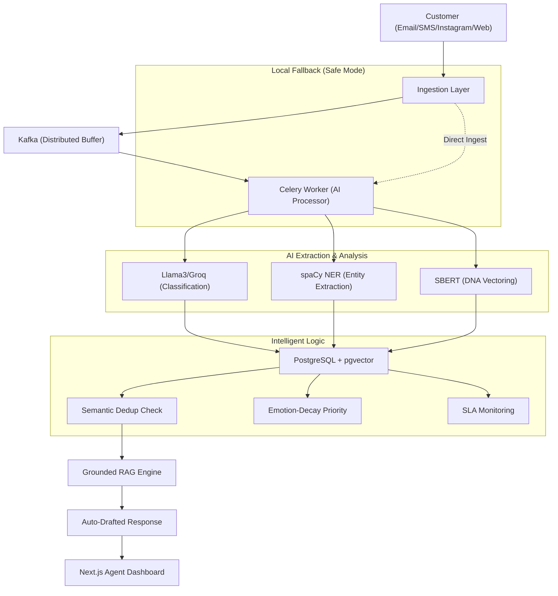

# CREST — Complaint Resolution & Escalation Smart Technology
### **Union Bank of India · iDEA 2.0 Hackathon · Phase 2 (POC Stage)**
**India's first RBI-aligned, Gen-AI powered grievance intelligence platform.**

---

## (A) Problem being Solved
Union Bank of India serves millions of customers across diverse regions. Current grievance systems face three critical bottlenecks:
1. **The "Duplicate" Storm**: Redundant tickets across Email/Instagram/App waste 30% of agent time.
2. **Static Prioritization**: FIFO queues ignore high-emotion P0 cases and decaying SLAs.
3. **Response Inconsistency**: Manual drafting leads to compliance and quality risks.

### **Core Inventions & Features**
- **Dual-RAG Intelligence Engine**: Combines official PDF manual chunks *and* vectorized history of past successful resolutions (`pgvector`) to feed Groq grounded context for generating highly consistent draft responses.
- **Emotion-Decay Priority Queue**: 
  `priority_score = severity_weight × anger_score × MIN(3.0, 1 + LN(1 + hours_waiting / 8))`
  Combines severity, live frustration scores, and wait times to boost critical or abusive cases instantly to the top of the queue.
- **Complaint DNA Fingerprinting**: Ingested tickets are vectorized into 768-dim vectors via local SBERT; cosine similarity > 0.92 flags cross-channel duplicates instantly.
- **Instagram DM Auto-Responder**: Integrated Meta Graph API to intercept DMs, dynamically reply, and direct customers to a secure tracking portal while maintaining DPDP compliance.
- **Adaptive AI Severity Prompting**: Ingested messages with high anger, frustration, or severe abuse are dynamically escalated to P0/P1 to protect brand integrity.

### **Technical Workflow (Enterprise Hybrid Architecture)**


---

## (B) How to Run Locally

### **Project Structure**
```
crest/
├── backend/            # FastAPI + SQLAlchemy
├── ai/                 # RAG, NER, & Embeddings
├── integrations/       # Email & Channel Listeners
├── frontend/           # Next.js 14 Dashboard
└── scripts/            # Demo seeding & tools
```

### **Quick Start**
1. **Env**: `cp .env.example .env` and add your `GROQ_API_KEY`.
2. **API**: `uvicorn backend.main:socket_app --port 8000 --reload`
3. **Worker**: `celery -A backend.workers.celery_app worker --loglevel=info -P solo`
4. **UI**: `cd frontend/nextjs-app && npm run dev`

---

## (C) Libraries & Dependencies
- **AI**: `llama-index`, `sentence-transformers`, `spacy`, `groq`.
- **Backend**: `fastapi`, `sqlalchemy`, `pgvector`, `celery`, `redis-py`.
- **Frontend**: `next`, `tailwind-css`, `socket.io-client`, `lucide-react`.

---

## (D) Sample Dataset & Simulation
Evaluators can populate the system with 50+ realistic grievances using:
```bash
python -m backend.utils.reset_db
```
*Simulates issues like ATM failures, KYC delays, and Loan queries with pre-calculated sentiment metrics.*

---

## (E) Known Limitations & Readiness
1. **API Rate Limits**: Demo tier is limited to 14,400 tokens per minute.
2. **PII Masking**: Built-in redaction of Account Numbers/Phone Numbers before LLM processing.
3. **Audit Trail**: Full immutable audit trail for every action (RBI compliant).

### **API Endpoints Reference**
| Method | Path | Description |
|--------|------|-------------|
| POST | `/api/complaints/ingest` | Sync ingest (test/low-volume) |
| POST | `/api/integrations/sms/webhook` | SMS Ingest (Hybrid Kafka/Direct) |
| POST | `/api/integrations/whatsapp/webhook` | WhatsApp Ingest (Twilio) |
| POST | `/webhooks/whatsapp` | WhatsApp Ingest (legacy alias) |
| POST | `/api/integrations/instagram/webhook` | Instagram Ingest (Hybrid Kafka/Direct) |
| GET | `/api/complaints/queue` | Live priority queue |
| PATCH | `/api/complaints/{id}/assign` | Assign to agent |
| PATCH | `/api/complaints/{id}/resolve` | Resolve + push to KB |
| GET | `/api/analytics/dashboard` | KPI summary |

---

---

## (F) User Hierarchy & Portal System

CREST divides portal scopes strictly between **Public Citizens** and **Enterprise Officers** (Super Admins, Sub-Admins, and Employees) to balance transparency with rigorous administrative security:

### **1. Public Portal (`/ub_publicPortal`)**
Designed for maximum ease-of-use and dynamic citizen redressal:
*   **Multi-Channel Lodging:** Lodge grievances natively via direct web forms, email integrations, SMS headers, or Instagram DMs.
*   **Dual-Factor Live Tracking:** Track resolution status in real-time securely using the alphanumeric Visual Captcha (noise grid + distortion blur) combined with double-factor OTP authentication.
*   **RAG Knowledge Corner:** central 34+ FAQ structured directory mapped into 4 collapsible categories (Account Problems, Cards/Digital, Escalations, Customer Rights) to maximize readability and reduce customer friction.

---

### **2. Corporate Hierarchy & Control Panel (`/ub_CREST`)**

#### ** Super Administrator (`role: SUPER_ADMIN`)**
*   **Global Command Room:** Complete visual analytics of all bank branches and regions globally.
*   **Staff Roster Directory:** Add, delete, suspend, or inspect all system users, regional administrators, and officers globally.
*   **Global Superior Takeover:** Can claim any unresolved complaint across the entire bank. 

#### ** Regional Sub-Administrator (`role: SUB_ADMIN`)**
*   **Scoped Jurisdiction:** Scoped strictly to their designated regional ID (e.g. Maharashtra, NCR, etc.)—cannot access metrics of other regions.
*   **Team Supervision:** Oversee, activate, and manage junior officers within their regional roster.
*   **Regional Superior Takeover:** Can assign any unresolved regional ticket to themselves. 

#### ** Regional Officer / Employee (`role: EMPLOYEE`)**
*   **Auto-Load Balanced Queues:** Brand-new complaints are automatically load-balanced and distributed to the least-busy active officer within the corresponding region.
*   **Focused Workspace:** Strictly sees their own assigned tickets, preventing mental fatigue.
*   **Grounded Draft Management:** Read, edit, and approve the grounded RAG-generated manual draft.
*   **Superior Claim Lockout:** If a Sub-Admin or Super Admin takes over a complaint, the employee is safely locked out from editing drafts or resolving the case, displaying: *"Your superior is working with the complaint"*.
*   **Escalation Protocol:** Can escalate complex grievances upward to their regional Sub-Admin at any time.

#### ** Custom Resolution Notes & RBI Templates**
*   **Resolution Input:** Displays the placeholder *“Note if something was special...”* until the officer begins typing.
*   **Intelligent Reporting:** If the officer notes something unique about the case, it is logged in the permanent audit trail. If empty, the system automatically appends a generic, RBI-compliant resolution protocol note (e.g., *"Resolved via standard regional protocol"*).

---

## Team Gen Forge
- **Kshitij Singh**: Lead Backend & AI
- **Aayush Jaiswal**: Frontend & UI/UX
- **Laxya Gaba**: AI Logic
- **Saanvi Aggarwal**: DataBase , Deployment & Audit

---
*CREST · PS5: Unified Complaint Dashboard · Union Bank iDEA 2.0*
