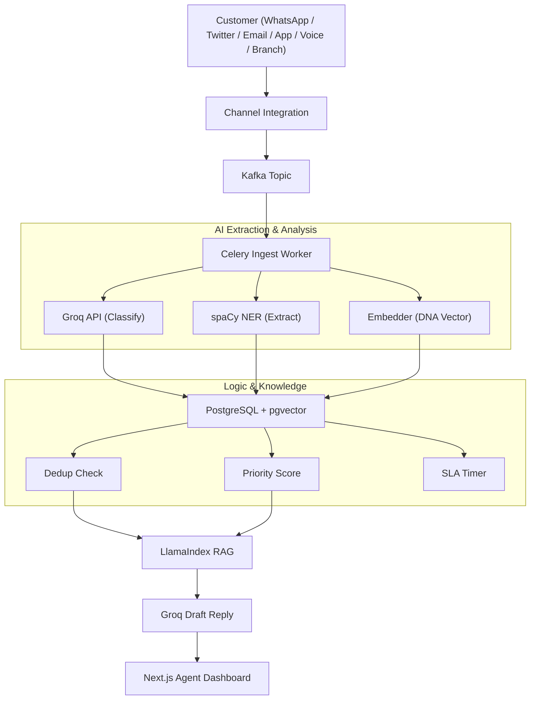

# CREST
### Complaint Resolution & Escalation Smart Technology
**India's first RBI-aligned Gen-AI grievance intelligence platform** kyuki aayush bola
PSBs Hackathon 2026 · Union Bank of India · Gen Forge · IDEA 2.0 · AI-CSPARC

---

## Project Structure

```
crest/
├── backend/
│   ├── api/
│   │   ├── complaints.py       # All complaint lifecycle endpoints
│   │   └── analytics.py        # Dashboard metrics & chart data
│   ├── workers/
│   │   ├── celery_app.py       # Celery config + Beat schedule
│   │   ├── ingest_worker.py    # Full AI pipeline per complaint (Celery task)
│   │   ├── priority_worker.py  # Emotion-Decay refresh every 5 min
│   │   └── sla_worker.py       # SLA monitoring + Slack/SendGrid alerts
│   ├── services/
│   │   ├── complaint_service.py # Core business logic: dedup, priority, SLA
│   │   └── spike_service.py    # Categorical surge detection & RCA triggers
│   ├── models/
│   │   ├── complaint.py        # SQLAlchemy ORM + Pydantic schemas
│   │   └── knowledge.py        # ResolutionKnowledge + SpikeSignal models
│   ├── utils/
│   │   ├── db.py               # Connection pool, SQLAlchemy engine
│   │   └── logger.py           # JSON structured logging
│   └── main.py                 # FastAPI app + Socket.IO mount
│
├── ai/
│   ├── agents/
│   │   ├── classifier_agent.py # Classifies P0-P4, anger, category
│   │   └── rca_agent.py        # Root Cause Analysis on complaint clusters
│   ├── rag/
│   │   └── retriever.py        # pgvector retrieval + RAG draft reply
│   ├── embeddings/
│   │   └── embedder.py         # 768-dim Complaint DNA vector generation
│   └── ner/
│       └── extractor.py        # Entity extraction: amounts, txn IDs, dates
│
├── integrations/
│   ├── whatsapp/
│   │   └── webhook.py          # WhatsApp integration + Whisper STT
│   ├── twitter/
│   │   └── stream.py           # Twitter listener
│   ├── email/
│   │   └── listener.py         # IMAP poller for grievance inbox
│   └── kafka/
│       ├── consumer.py         # Reads channel topics -> Celery dispatch
│       └── producer.py         # Shared publisher for all integrations
│
├── frontend/
│   └── nextjs-app/
│       ├── app/
│       │   ├── dashboard/page.tsx  # Main Dashboard (RCA alerts + Queue)
│       │   └── complaints/[id]/page.tsx # Complaint detail (Grounded RAG)
│       ├── components/
│       │   ├── queue/PriorityQueue.tsx # Live queue table (Socket.IO)
│       │   └── complaint/ComplaintDetail.tsx # RAG source rendering
│       └── lib/
│           ├── api.ts              # Typed API client
│           └── useSocket.ts        # Socket.IO real-time hook
│
├── scripts/
│   └── demo_spike.py           # Demo seeding script for PSBs presentation
│
├── requirements.txt            # Python dependencies
├── .env.example                # Environment variables
└── README.md
```

---

## Quick Start

### 1. Environment
```bash
cp .env.example .env
# Fill in GROQ_API_KEY (and OPENAI_API_KEY if using OpenAI embeddings)
```

### 2. Start all services
```bash
docker compose up -d
# Wait ~30 seconds for all health checks to pass
docker compose ps
```

### 3. Install Python deps (for running locally without Docker)
```bash
pip install -r requirements.txt
python -m pip install https://github.com/explosion/spacy-models/releases/download/en_core_web_sm-3.7.1/en_core_web_sm-3.7.1-py3-none-any.whl
```

### 4. Seed sample data
```bash
python -m backend.utils.db    # verify DB connection
# Schema auto-applies from infra/docker/schema.sql on first postgres start
```

### 5. Run API (without Docker)
```bash
uvicorn backend.main:socket_app --reload --port 8000
```

### 6. Run Celery workers
```bash
# Ingest worker
celery -A backend.workers.celery_app worker -Q ingest -c 4 --loglevel=info

# Scheduler worker + Beat (separate terminals)
celery -A backend.workers.celery_app worker -Q scheduler -c 2 --loglevel=info
celery -A backend.workers.celery_app beat --loglevel=info
```

### 7. Run dashboard
```bash
cd frontend/nextjs-app
npm install && npm run dev
# Open http://localhost:3000
```

---

## How a Complaint Flows Through CREST



---

## The Three Core Innovations

### 1. Complaint DNA Fingerprinting
Every complaint gets a **768-dimensional embedding vector** stored in PostgreSQL via pgvector. When a new complaint arrives, a cosine ANN query finds any existing open complaint with similarity > 0.92 — and automatically marks the new one as a duplicate. Zero manual deduplication.

### 2. Emotion-Decay Priority Queue
```
priority_score = severity_weight × anger_score × decay_factor
decay_factor   = MIN(3.0,  1 + LN(1 + hours_waiting / 8))
```
Recalculated every 5 minutes by Celery Beat. A 3-day-old furious customer always outranks a calm new ticket.

### 3. Proactive Spike Prediction
The `spike_signals` table logs outages, app updates, and rate changes. The ML model correlates these with historical complaint velocity to predict surges 24 hours in advance — shifting operations from reactive firefighting to truly predictive.

---

## API Endpoints

| Method | Path | Description |
|--------|------|-------------|
| POST | `/api/complaints/ingest` | Sync ingest (test/low-volume) |
| GET | `/api/complaints/queue` | Live priority queue |
| GET | `/api/complaints/{id}` | Full complaint detail |
| GET | `/api/complaints/{id}/similar` | DNA-matched similar complaints |
| PATCH | `/api/complaints/{id}/assign` | Assign to agent |
| PATCH | `/api/complaints/{id}/approve-draft` | Approve AI draft reply |
| PATCH | `/api/complaints/{id}/resolve` | Resolve + push to KB |
| GET | `/api/complaints/{id}/audit` | Immutable RBI audit trail |
| GET | `/api/analytics/dashboard` | KPI summary |
| GET | `/api/analytics/by-category` | Category breakdown |
| GET | `/api/analytics/volume-trend` | Daily volume chart data |
| GET | `/api/analytics/spike-signals` | Recent spike predictions |

---

## Team — Gen Forge

| Name | Role |
|------|------|
| Saanvi Aggarwal | DevOps + Database Architecture |
| Laxya Gaba | AI / NLP Engineering |
| Aayush Jaiswal | Frontend + UI/UX |
| Kshitij Singh | Backend + API Design |

---

*CREST · PSBs Hackathon 2026 · Union Bank of India · 4x ROI · Zero SLA Breaches · 500M+ Customers*
