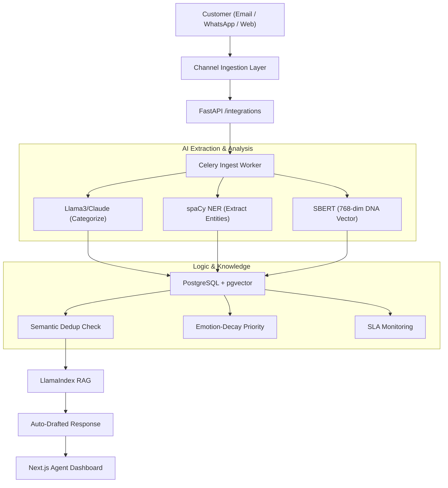

# CREST — Complaint Resolution & Escalation Smart Technology
### **Union Bank of India · iDEA 2.0 Hackathon · Phase 2 (POC Stage)**
**India's first RBI-aligned, Gen-AI powered grievance intelligence platform.**

---

## 🚀 Phase 2: POC Status
This repository contains the working **Proof of Concept (POC)** for Team **Gen Forge**. Unlike a static mockup, CREST is a fully functional end-to-end system featuring:
- **Live AI Ingestion Pipeline**: Real-time processing of emails and web-forms.
- **Grounded RAG Engine**: Automated response drafting using pgvector and bank policy PDFs.
- **3-Tier RBAC**: Region-locked dashboards for Admins and Task-focused views for Employees.
- **Real-time Pulse**: Socket.IO powered synchronization for instant queue updates.

---

## 📂 (A) The Problem
Union Bank of India serves millions of customers. Current grievance systems face three critical bottlenecks:
1. **The "Duplicate" Storm**: Redundant tickets across Email/Twitter/App waste 30% of agent time.
2. **Static Prioritization**: First-In-First-Out (FIFO) ignores high-emotion P0 cases.
3. **Response Inconsistency**: Manual drafting leads to compliance risks.

**The CREST Solution**: We solve this with semantic **Deduplication**, **Emotion-Decay Prioritization**, and **Policy-Grounded RAG**.

---

## 🔄 How a Complaint Flows Through CREST


---

## 💡 Core Innovations (Technical Depth)

### 1. Complaint DNA Fingerprinting
Every complaint is converted into a **768-dimensional embedding vector**. When a new ticket arrives, we perform a cosine-similarity search via **pgvector**. If similarity > 0.92, it's flagged as a duplicate, preventing redundant agent effort.

### 2. Emotion-Decay Priority Queue
Instead of FIFO, we use a dynamic scoring algorithm:
```
priority_score = severity_weight × anger_score × decay_factor
decay_factor   = MIN(3.0, 1 + LN(1 + hours_waiting / 8))
```
A 3-day-old furious customer automatically outranks a calm new ticket, ensuring high-risk grievances never slip through the cracks.

### 3. Grounded RAG (Anti-Hallucination)
Our Gen-AI does not "guess" answers. It retrieves the top 3 relevant sections from the **Union Bank Service Manual** and uses them as context to draft a response, providing agents with citations and sources for every word.

---

## 🏗️ (C) Technical Architecture & Stack
- **Frontend**: Next.js 14, Tailwind CSS, Socket.IO.
- **Backend**: FastAPI, SQLAlchemy, Redis (Broker), Celery (Workers).
- **AI**: HuggingFace (SBERT), Groq/Claude (LLM), spaCy (NER), LlamaIndex (RAG).

---

## 💻 (B) How to Run Locally

### **1. Setup Environment**
```bash
git clone https://github.com/kshitijsingh1-tech/CREST.git
cd CREST
cp .env.example .env
# Add your GROQ_API_KEY
```

### **2. Start Services**
```bash
# Backend (Terminal 1)
python -m venv .venv && source .venv/bin/activate
pip install -r requirements.txt
uvicorn backend.main:socket_app --port 8000 --reload

# Worker (Terminal 2)
celery -A backend.workers.celery_app worker --loglevel=info -P solo

# Frontend (Terminal 3)
cd frontend/nextjs-app && npm install && npm run dev
```

---

## 📊 (D) Sample Dataset & Simulation
Run the following to clear the DB and inject 50+ realistic banking grievances (ATM, KYC, Loans):
```bash
python -m backend.utils.reset_db
```

---

## ⚠️ (E) Known Limitations
1. **API Rate Limits**: Gen-AI drafting is throttled to 3 requests/min in the demo tier.
2. **Channel Simulation**: WhatsApp/Twitter use webhook mocks for the POC.
3. **Offline Mode**: AI features require an internet connection for LLM inference.

---

## 👥 Team Gen Forge
- **Kshitij Singh**: Lead Backend & AI
- **Aayush Jaiswal**: Frontend & UI/UX
- **Laxya Gaba**: AI Logic & RAG
- **Saanvi Aggarwal**: Product & Audit

---
*CREST · PS5: Unified Complaint Dashboard · Union Bank iDEA 2.0*
