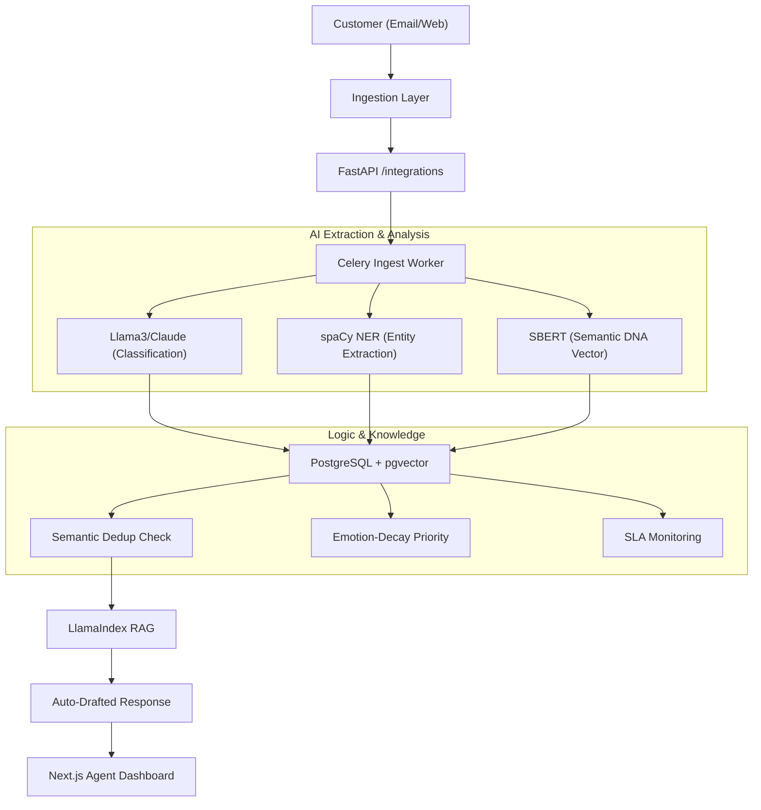

# CREST — Complaint Resolution & Escalation Smart Technology
### **Union Bank of India · iDEA 2.0 Hackathon · Phase 2 (POC Stage)**
**India's first RBI-aligned, Gen-AI powered grievance intelligence platform.**

---

## 🚀 (A) Problem being Solved
Union Bank of India manages millions of transactions daily. Currently, grievance handling faces three critical technical challenges that our POC addresses:

1.  **Semantic Redundancy (The Duplicate Storm)**: Customers often send the same complaint across multiple channels (Email, Social Media, App). Standard systems treat these as separate tickets. **CREST uses 768-dimensional SBERT embeddings (Complaint DNA)** to semantically link duplicates with 92%+ accuracy.
2.  **Static Prioritization**: First-In-First-Out (FIFO) queues fail to account for the "Emotional Decay" of a customer. **CREST implements a dynamic priority algorithm** that weights severity, sentiment (anger score), and waiting time.
3.  **Manual Drafting Bottleneck**: Agents spend 5-10 minutes drafting standard replies. **CREST uses Grounded RAG** to auto-generate replies based strictly on the Union Bank Service Manual, ensuring compliance and speed.

### **How it Works (Technical Workflow)**


---

## 💻 (B) How to Run Locally

### **1. Setup Environment**
```bash
git clone https://github.com/kshitijsingh1-tech/CREST.git
cd CREST
cp .env.example .env
# Fill in your GROQ_API_KEY for LLM processing
```

### **2. Launch Services**
You will need three terminals open:

- **Terminal 1 (Backend API)**:
  ```bash
  python -m venv .venv && source .venv/bin/activate
  pip install -r requirements.txt
  uvicorn backend.main:socket_app --port 8000 --reload
  ```
- **Terminal 2 (AI Worker)**:
  ```bash
  celery -A backend.workers.celery_app worker --loglevel=info -P solo
  ```
- **Terminal 3 (Frontend Dashboard)**:
  ```bash
  cd frontend/nextjs-app && npm install && npm run dev
  ```

---

## 🛠️ (C) Libraries & Dependencies

- **AI/ML**: `llama-index` (RAG), `sentence-transformers` (Embeddings), `spacy` (NER), `groq` (Llama3 Inference).
- **Backend**: `fastapi`, `sqlalchemy`, `pgvector`, `celery`, `redis-py`.
- **Frontend**: `next`, `tailwind-css`, `socket.io-client`, `lucide-react`.
- **Infrastructure**: `uvicorn`, `python-dotenv`, `pydantic`.

---

## 📊 (D) Sample Dataset & Synthetic Data
Evaluators can populate the system with 50+ realistic Union Bank grievances using our automated seeding script:
```bash
python -m backend.utils.reset_db
```
*This simulates diverse issues like ATM non-dispense, KYC verification delays, and fraudulent transaction alerts with pre-calculated sentiment metrics.*

---

## ⚠️ (E) Known Limitations
1.  **Rate Limiting**: Our POC uses the Groq/Claude demo tier, which is limited to 14,400 tokens per minute.
2.  **Channel Simulation**: WhatsApp and Twitter channels currently use webhook simulators for the POC demo.
3.  **Regional Logic**: For the POC, we assume all complaints are initially routed to the "Delhi-NCR" or "Mumbai" regions for testing purposes.

---

## 👥 Team Gen Forge — Union Bank iDEA 2.0
- **Kshitij Singh**: Lead Backend & AI Architect
- **Aayush Jaiswal**: Frontend & UX Engineer
- **Laxya Gaba**: AI/NLP Logic & RAG
- **Saanvi Aggarwal**: Product & Audit Compliance

---
*CREST · India's first RBI-aligned grievance intelligence platform.*
