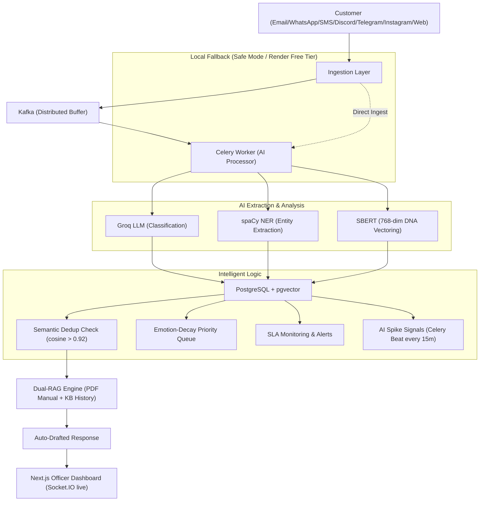

# CREST — Complaint Resolution & Escalation Smart Technology
### Union Bank of India · iDEA 2.0 Hackathon 
**RBI-aligned, Gen-AI powered grievance intelligence platform.**

---

## (a) Problem Being Solved

Union Bank of India serves millions of customers across every region of India. When something goes wrong — an ATM fails, a KYC application stalls, a loan query goes unanswered — customers expect fast, transparent, and consistent resolution. Traditional grievance systems fail in three critical ways:

1. **The Duplicate Storm** — The same complaint arrives via Email, WhatsApp, and the web app simultaneously. Agents spend up to 30% of their time handling the exact same issue multiple times — wasted effort, frustrated customers.
2. **Static, Unfair Queues** — Standard systems use FIFO. A low-urgency query from 9 AM blocks a P0 account-freeze emergency from 9:30 AM. High-emotion, time-sensitive cases decay unnoticed.
3. **Inconsistent Responses** — Every officer drafts replies manually, leading to varying tone, missing RBI compliance clauses, and quality risks. No two responses are the same even for identical issues.

### Core Innovations

| Feature | Description |
|---|---|
| **Complaint DNA Fingerprinting** | Every complaint is vectorized into a 768-dim SBERT embedding. Cosine similarity > 0.92 flags cross-channel duplicates instantly — agents never handle the same case twice. |
| **Emotion-Decay Priority Queue** | `priority_score = severity_weight × anger_score × MIN(3.0, 1 + LN(1 + hours_waiting / 8))` — P0 emergencies always surface to the top automatically. |
| **AI-Grounded Draft Responses** | Before an officer opens a complaint, CREST has already generated a draft reply grounded in the Union Bank Service Manual via a Dual-RAG engine (PDF chunks + resolved case history). |
| **Omnichannel Ingestion** | Webhooks for Email (IMAP), WhatsApp/SMS (Twilio), Discord, Telegram, Instagram (Meta Graph API), and Web. A conversational AI detects intent and auto-routes tickets. |
| **Bidirectional Multilingual Sync** | Integrates with MeitY Bhashini to detect and translate regional languages. Officer edits in English are automatically back-translated to the customer's native language before saving. |
| **AI Spike Detection & RCA** | A Celery Beat worker monitors complaint volumes every 15 minutes. Surges > 250% trigger an AI Root Cause Analysis (RCA) agent that identifies systemic outages and broadcasts live alerts to officer dashboards. |
| **Dynamic Regional Auto-Routing** | Parses location replies across all channels to auto-assign tickets to the least-busy regional branch officer. |

### Architecture



---

## (b) How to Run Locally

> **Requirements:** Python 3.12+, Node.js 18+, Docker & Docker Compose

### Step 1 — Clone and configure environment

```bash
git clone https://github.com/kshitijsingh1-tech/CREST.git
cd crest
cp .env.example .env
```

Open `.env` and fill in the required values. The **only mandatory key** to get started is:

```env
GROQ_API_KEY=gsk-your-key-here   # Required for AI classification & draft generation
```

All other keys (Twilio, Telegram, Discord, etc.) are optional and only needed for specific channel integrations.

### Step 2 — Start infrastructure services (PostgreSQL, Redis, Kafka)

```bash
docker compose up -d postgres redis kafka zookeeper kafka-setup
```

This starts:
- **PostgreSQL 16 + pgvector** on `localhost:5432`
- **Redis 7** on `localhost:6379`
- **Kafka + Zookeeper** on `localhost:9092` (with auto-created topics)

### Step 3 — Install Python dependencies

```bash
# Create and activate a virtual environment (recommended)
python -m venv .venv
source .venv/bin/activate        # Linux/macOS
.venv\Scripts\activate           # Windows

# Install all dependencies
pip install -r requirements.txt

# Install the spaCy English NLP model (required for NER)
python -m pip install https://github.com/explosion/spacy-models/releases/download/en_core_web_sm-3.7.1/en_core_web_sm-3.7.1-py3-none-any.whl
```

> ⚠️ PyTorch (`torch`) is installed as a CPU-only build by default (see `requirements.txt`). GPU builds are not required.

### Step 4 — Start the FastAPI backend

```bash
uvicorn backend.main:socket_app --reload --port 8000
```

On first startup the API will:
1. Auto-create all PostgreSQL tables and the `pgvector` extension.
2. Seed default regions (Delhi, Mumbai, Bangalore), channels, and the Super Admin account.
3. Start the IMAP Email listener and Discord Gateway bot as internal background threads.
4. Pre-warm the SBERT sentence embedding model.

### Step 5 — Start Celery workers (required for background AI tasks)

Run each in a separate terminal:

```bash
# Ingest worker — processes complaints from the Kafka queue
celery -A backend.workers.celery_app worker -Q ingest -c 4 --loglevel=info

# Scheduler worker — runs SLA checks, priority score refreshes
celery -A backend.workers.celery_app worker -Q scheduler -c 2 --loglevel=info

# Beat scheduler — triggers periodic tasks every N minutes
celery -A backend.workers.celery_app beat --loglevel=info
```

> **Without Celery**: Set `CREST_USE_DIRECT_INGEST=1` and `CREST_DEV_MOCK=0` in `.env` to run the AI pipeline synchronously in-request (suitable for low-volume testing). **AI Spike Detection, SLA alerts, and priority refreshes will not run without Celery Beat.**

### Step 6 — Start the Kafka consumer (optional, for full Kafka pipeline)

```bash
python -m integrations.kafka.consumer
```

### Step 7 — Install and start the Next.js frontend

```bash
cd frontend/nextjs-app
npm install
npm run dev
```

The dashboard is available at **http://localhost:3000**.

---

### Quick Start with Docker Compose (Full Stack)

To run the entire stack with a single command:

```bash
docker compose up -d
```

This starts all services: PostgreSQL, Redis, Kafka, FastAPI API, all Celery workers, and the Next.js dashboard.

---

### Demo Credentials

| Role | Email | Password |
|---|---|---|
| Super Administrator | `admin@unionbank.com` | `admin123` |
| Mumbai Sub-Admin | `mumbai_admin@unionbank.com` | `admin123` |
| Mumbai Officer | `mumbai_officer@unionbank.com` | `officer123` |

> On the login page, click the **⚡ Auto-fill Super Admin** button to fill credentials automatically.

### Key Environment Variable Flags

| Variable | Default | Description |
|---|---|---|
| `CREST_DEV_MOCK` | `0` | Set to `1` to use in-memory mock data. No DB or AI required. |
| `CREST_USE_DIRECT_INGEST` | `0` | Set to `1` to bypass Kafka and ingest directly into the API. |
| `CREST_USE_PGVECTOR` | `1` | Set to `0` to disable vector embeddings (disables dedup). |
| `EMBEDDING_MODE` | `mock` | Set to `local` for live SBERT embeddings. |
| `AUTO_APPROVE_DRAFTS` | `0` | Set to `1` to auto-approve AI drafts without officer review. |

---

## (c) Libraries & Dependencies

### Python Backend (`requirements.txt`) — Python 3.12+

| Category | Package | Version | Purpose |
|---|---|---|---|
| **API** | `fastapi` | 0.110.3 | REST API framework |
| **API** | `uvicorn[standard]` | 0.29.0 | ASGI server |
| **API** | `python-socketio` | 5.11.3 | WebSocket / Socket.IO for live dashboard updates |
| **API** | `pydantic` | 2.12.5 | Request/response validation |
| **API** | `httpx` | 0.27.0 | Async HTTP client (used by integration senders) |
| **Database** | `sqlalchemy` | 2.0.30 | ORM and query builder |
| **Database** | `psycopg2-binary` | 2.9.9 | PostgreSQL driver |
| **Database** | `pgvector` | 0.2.5 | 768-dim vector storage for complaint DNA fingerprints |
| **Task Queue** | `celery` | 5.4.0 | Distributed background task processing |
| **Task Queue** | `redis` | 5.0.4 | Celery broker and result backend |
| **Task Queue** | `confluent-kafka` | 2.4.0 | Kafka producer and consumer for omnichannel ingestion |
| **AI / LLM** | `groq` (via `openai`) | — | Groq Cloud API client for LLM inference (Llama 3.3 70B) |
| **AI / LLM** | `langchain` | 0.2.1 | LLM chaining and prompt management |
| **AI / LLM** | `llama-index` | 0.10.40 | RAG engine for PDF-backed knowledge base |
| **AI / LLM** | `sentence-transformers` | 2.7.0 | Local SBERT model for 768-dim complaint embeddings |
| **AI / LLM** | `torch` (CPU) | 2.3.0 | PyTorch runtime for SBERT |
| **AI / LLM** | `openai` | 1.30.1 | Whisper STT fallback + OpenAI embedding fallback |
| **NLP** | `spacy` | 3.7.4 | Named Entity Recognition (account numbers, locations, names) |
| **NLP** | `en_core_web_sm` | 3.7.1 | spaCy English NLP model (installed separately) |
| **Search** | `elasticsearch` | 8.13.0 | Full-text search for complaint analytics |
| **Search** | `pypdf` | 4.3.1 | PDF text extraction for RAG knowledge base ingestion |
| **Auth** | `python-jose[cryptography]` | 3.3.0 | JWT token generation and verification |
| **Auth** | `passlib[bcrypt]` | 1.7.4 | Password hashing |
| **Integrations** | `discord.py` | 2.3.2 | Discord Gateway bot for DM ingestion |
| **Integrations** | `PyNaCl` | 1.5.0 | Discord webhook signature verification |
| **Utils** | `python-dotenv` | 1.0.1 | `.env` file loading |
| **Utils** | `numpy` | 1.26.4 | Embedding vector operations |

### Frontend (`frontend/nextjs-app/package.json`) — Node.js 18+

| Package | Version | Purpose |
|---|---|---|
| `next` | 14.2.3 | React framework (App Router, RSC, SSR) |
| `react` / `react-dom` | 18.3.1 | UI rendering |
| `socket.io-client` | 4.7.5 | Real-time live queue updates from backend |
| `recharts` | 2.12.7 | Analytics charts (volume trends, categories) |
| `lucide-react` | 1.16.0 | Icon library |
| `js-cookie` | 3.0.5 | JWT cookie management |
| `tailwindcss` | 3.4.3 | Utility-first CSS framework |
| `typescript` | 5 | TypeScript compiler |
| `three` | 0.183.2 | 3D/WebGL effects on landing page |

### Infrastructure Services (via Docker Compose)

| Service | Image | Purpose |
|---|---|---|
| PostgreSQL + pgvector | `pgvector/pgvector:pg16` | Primary relational DB with vector extension |
| Redis | `redis:7-alpine` | Celery broker, result backend, session cache |
| Kafka | `confluentinc/cp-kafka:7.6.0` | Distributed message queue for omnichannel ingestion |
| Zookeeper | `confluentinc/cp-zookeeper:7.6.0` | Kafka cluster coordination |
| Elasticsearch | `docker.elastic.co/elasticsearch/elasticsearch:8.13.0` | Full-text analytics search |

---

## (d) Sample Dataset & Synthetic Data Generation

### Pre-loaded Data (Automatic on First Run)

When the API starts for the first time, `initialize_database()` automatically seeds:
- **Regions**: Delhi, Mumbai, Bangalore
- **Channels**: email, whatsapp, sms, app, twitter, voice, branch, web, instagram, discord, telegram
- **Demo users**: Super Admin, Mumbai Sub-Admin, Mumbai Officer (see credentials in section b)

### Synthetic Complaint Data

To populate the system with 50+ realistic grievances (ATM failures, KYC delays, UPI issues, loan queries) with pre-calculated sentiment, severity scores, and embeddings:

```bash
python -m backend.utils.reset_db
```

> ⚠️ **This wipes all existing data** and re-seeds from scratch. Use only on a fresh or development database.

### RAG Knowledge Base (PDF Documents)

The `ragdataset/` directory contains the official Union Bank of India policy documents used for AI-grounded draft generation:

| File | Description |
|---|---|
| `grievance-redressal-policy-2020-21.pdf` | Union Bank Grievance Redressal Policy |
| `policy-on-compensation-grievance-redressal-customer-rights-2024-25.pdf` | Customer Rights & Compensation Policy 2024–25 |
| `Procedure_to_lodge_grievance_online.pdf` | Step-by-step online grievance procedure |
| `Accessing_IB_Portal_with_Keyboard_and_Screen_Reader.pdf` | Accessibility policy document |
| `union_bank_rag_dataset.pdf` | Curated Q&A dataset for RAG retrieval |

These PDFs are automatically chunked (chunk size: 1200, overlap: 200) and indexed on startup. Set `CREST_RAG_DATASET_DIR=ragdataset` in `.env`.

### FAQ Seeding (Public Knowledge Corner)

```bash
python scripts/seed_faqs.py
```

Seeds the public-facing knowledge corner with 34+ structured FAQ entries across 4 categories: Account Problems, Cards & Digital, Escalations, and Customer Rights.

### Demo Spike Signal

To trigger a sample AI Spike Signal (bypassing the 15-minute Celery cycle):

```bash
python scripts/demo_spike.py
```

---

## (e) Known Limitations

| # | Limitation | Detail |
|---|---|---|
| 1 | **Groq API Rate Limits** | The demo tier is limited to ~14,400 tokens/minute. Under heavy concurrent load, AI classification and draft generation may slow down or return rate-limit errors. |
| 2 | **Background Tasks on Render Free Tier** | Render's Free Tier does not support background worker services. Celery Beat (AI Spike Detection, priority refreshes, SLA alerts) will not run on a Free Render instance. Use `CREST_USE_DIRECT_INGEST=1` as a fallback; deploy on a paid Render plan or Railway for the full stack. |
| 3 | **SBERT Cold Start Latency** | The first embedding request loads the `all-MiniLM-L6-v2` SBERT model (~90 MB) into memory. This can add 5–20 seconds of cold-start latency. The API pre-warms the model on startup to minimize this. |
| 4 | **Kafka Not Required for Basic Use** | Running the full Kafka pipeline (Zookeeper + Kafka + consumer) requires ~2 GB RAM. Set `CREST_USE_DIRECT_INGEST=1` to bypass Kafka for local testing and Render deployments. |
| 5 | **WhatsApp Sandbox Limitation** | The Twilio WhatsApp sandbox requires customers to first send a join code (`join contain-goes` to `+1 415 523 8886`) before receiving messages. Production deployment requires a verified Meta Business Account. |
| 6 | **Instagram & Meta Graph API** | Instagram DM ingestion requires an approved Meta Business integration. The webhook verification token (`crest_instagram_demo_key_2026`) is set for demo purposes only. |
| 7 | **PII Masking is Regex-based** | Account numbers and phone numbers are masked via regex before LLM processing. Complex or non-standard PII formats may not be caught. |
| 8 | **spaCy NER English Only** | The bundled `en_core_web_sm` model performs NER on English text only. Regional-language complaints are translated to English first, which may reduce entity extraction accuracy for some names and places. |
| 9 | **pgvector Cosine Threshold** | The duplicate detection threshold (cosine similarity > 0.92) is tuned for banking complaints. Very short or generic complaint texts may trigger false-positive duplicate flags. |
| 10 | **No SMS OTP in Demo** | The public complaint tracking page uses a visual CAPTCHA + SMS OTP. In the demo environment, the OTP is logged to the backend console instead of being delivered by SMS (Twilio credentials required for live delivery). |

---

## (f) User Hierarchy & Role-Based Access

CREST divides portal access between **Public Citizens** and **Enterprise Officers** with strict role-based scoping:

### Public Portal (`/ub_publicPortal`)
- Lodge complaints without login via web form, Email, WhatsApp, Discord, Telegram, or Instagram.
- Track resolution status with reference ID + OTP dual-factor verification.
- Browse the RAG-powered FAQ Knowledge Corner (34+ entries, 4 categories).

### Corporate Dashboard (`/ub_CREST`) — Role Hierarchy

| Role | Scope | Key Capabilities |
|---|---|---|
| `SUPER_ADMIN` | Global (all regions) | Full analytics, all complaints, staff management, account suspension |
| `SUB_ADMIN` | Assigned region only | Regional analytics, manage officers, take over any regional complaint |
| `EMPLOYEE` | Own assigned queue only | Review AI drafts, approve/edit responses, escalate to Sub-Admin |

- **Superior Claim Lockout**: If a Sub-Admin or Super Admin takes over a complaint, the officer is locked out with the message: *"Your superior is working with the complaint."*
- **Resolution Notes**: If the officer leaves the note blank, the system automatically appends a generic RBI-compliant protocol note.

---

## (g) Scheduled Background Tasks (Celery Beat)

| Task | Frequency | Function |
|---|---|---|
| Priority Score Refresh | Every 5 minutes | Recalculates Emotion-Decay scores for all open complaints |
| SLA Alert Dispatch | Every 10 minutes | Sends alerts for complaints approaching SLA breach |
| SLA Status Update | Every 30 minutes | Marks complaints as `breached` in the database |
| AI Spike Detection | Every 15 minutes | Compares hourly volume vs 24h baseline; triggers RCA agent on surges > 250% |

---

## (h) API Endpoints Reference

| Method | Path | Description |
|---|---|---|
| `GET` | `/api/health` | Service health check |
| `POST` | `/api/complaints/ingest` | Synchronous complaint ingest (test / direct mode) |
| `GET` | `/api/complaints/queue` | Live priority-sorted queue |
| `GET` | `/api/complaints/{id}` | Single complaint detail |
| `PATCH` | `/api/complaints/{id}/assign` | Assign complaint to officer |
| `PATCH` | `/api/complaints/{id}/escalate` | Escalate complaint up the hierarchy |
| `PATCH` | `/api/complaints/{id}/approve-draft` | Approve (and optionally edit) the AI draft reply |
| `PATCH` | `/api/complaints/{id}/resolve` | Resolve complaint and push resolution to KB |
| `GET` | `/api/complaints/{id}/audit` | Full immutable audit trail |
| `GET` | `/api/analytics/dashboard` | KPI summary (open, P0, SLA breached, resolved today) |
| `GET` | `/api/analytics/spike-signals` | Recent AI spike signals (last N hours) |
| `GET` | `/api/analytics/volume-trend` | Volume trend (last 14 days) |
| `POST` | `/api/integrations/sms/webhook` | Twilio WhatsApp/SMS ingest webhook |
| `POST` | `/api/integrations/instagram/webhook` | Instagram DM ingest webhook |
| `POST` | `/api/integrations/discord/webhook` | Discord interaction webhook |
| `POST` | `/api/integrations/telegram/webhook` | Telegram bot ingest webhook |

---

## (i) Compliance & Regulatory Alignment

| Framework | Mandate | CREST Implementation |
|---|---|---|
| **Bhashini AI / NLTM** | Public services accessible in regional Indian languages | Auto-detects and translates Hindi, Tamil, Bengali, Telugu via Bhashini API |
| **India AI Mission** | Secure, unbiased, ethical AI in critical infrastructure | Local SBERT embeddings, sandboxed LLM prompts, zero hallucination guardrails |
| **RBI Ombudsman Scheme 2021** | 30-day resolution caps, escalation routes, Zero-Liability | Emotion-Decay Queue, automatic SLA breach escalation, immutable audit trail |
| **DPDP Act 2023** | PII protection, data trails, masked sensitive data | Regex PII masking before LLM dispatch, JWT-gated access to unmasked records |
| **MeitY IT Standards** | Certified hosting, 2FA, encryption, cyber tracking | CAPTCHA + OTP public tracking, audit logs, bcrypt password hashing |

---

## Team Gen Forge
- **Kshitij Singh** — Lead Backend & AI
- **Aayush Jaiswal** — Frontend & UI/UX
- **Laxya Gaba** — AI Logic
- **Saanvi Aggarwal** — Database, Deployment & Audit

---
*CREST · PS5: Unified Complaint Dashboard · Union Bank iDEA 2.0*
